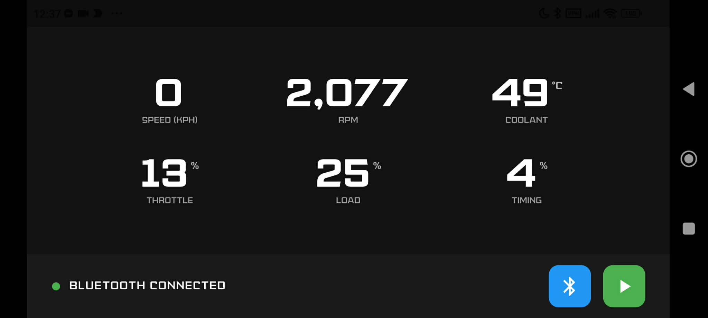

# 🚗 Flutter OBD2

[](https://github.com/AceBurgundy/Flutter-OBD2/actions/workflows/flutter_ci.yml)
[](https://pub.dev/packages/obd2)

A **modern SAE J1979 OBD-II SDK for Flutter**.

Flutter OBD2 provides a clean, type-safe, and transport-separated architecture for communicating with **ELM327-compatible Bluetooth Low Energy (BLE)** adapters using the **SAE J1979 (Generic OBD-II)** standard.

> ⚙️ This SDK intentionally supports **SAE J1979 only**.
> It does **not** implement UDS or manufacturer-specific diagnostic protocols.

## 📱 Platform Support

| Platform | Status          |
| -------- | --------------- |
| Android  | ✅ Supported     |
| iOS      | ⚠️ Untested     |
| macOS    | ❌ Not Supported |
| Windows  | ⚠️ Untested     |
| Web      | ❌ Not Supported |

## 📦 Current Release Status

**Version:** `0.10.x` (Stabilization Phase)

* ✅ Mode 01 (Live Telemetry) — Production ready
* 🚧 Modes 02–04 — Implemented, limited real-world validation
* 🚧 OdometerEngine — Experimental
* 🧪 Full unit test coverage with CI integration
* 🏗 Architecture finalized for 1.0 milestone

## 📊 Example Dashboard



## ✨ Why Flutter OBD2?

Most OBD libraries:

* Mix transport and protocol logic
* Expose raw hex responses
* Require manual PID parsing
* Overload the ECU with unsafe polling

Flutter OBD2 provides:

* ✅ Clean layered architecture
* ✅ Strongly typed `DetailedPID<T>` system
* ✅ Adaptive, collision-safe telemetry scheduler
* ✅ Concurrency-safe command lifecycle
* ✅ Service-level diagnostic execution
* ✅ Formula evaluation engine
* ✅ Greedy BLE compatibility layer
* ✅ Strict SAE J1979 implementation

This is a **diagnostic SDK**, not just a Bluetooth wrapper.

# 🏗 Architecture Overview

```
BluetoothAdapterOBD2  (BLE Transport)
        ↓
AdapterOBD2           (Core Engine)
        ↓
SaeJ1979 Protocol
        ├── telemetry
        ├── freezeFrame
        ├── readCodes
        └── clearCodes
```

## 🔌 Transport Layer — `BluetoothAdapterOBD2`

Handles:

* BLE connection
* GATT discovery
* Characteristic subscription
* Raw byte streaming
* ELM327 initialization

## 🧠 Core Engine — `AdapterOBD2`

Handles:

* ASCII encoding / decoding
* Concurrency-safe raw command execution
* Strict request lifecycle control
* Service-level abstraction (`sendService`, `sendServiceWithPID`)
* Response buffering & header validation
* Formula evaluation
* Composite PID parsing

This separation ensures transport and diagnostic layers remain fully independent.

# 🏎 SAE J1979 Protocol

Provides:

* Static PID definitions
* Mode grouping (01–04)
* Byte extraction logic
* Standards-compliant DTC decoding
* Freeze frame conversion logic

# 🚀 Getting Started

## 🧰 Requirements

* Flutter 3.x
* Dart 3.x
* ELM327-compatible BLE adapter (NexLink BLE adapters recommended)

## 1️⃣ Installation

```yaml
dependencies:
  obd2: ^0.10.0
  flutter_blue_plus: ^2.1.0
```

## 2️⃣ Connect to Adapter

```dart
import 'package:obd2/obd2.dart';
import 'package:flutter_blue_plus/flutter_blue_plus.dart';

final adapter = BluetoothAdapterOBD2();

await adapter.connect(myBluetoothDevice);
```

The adapter automatically:

* Connects
* Discovers services
* Subscribes to notify/indicate characteristics
* Selects writable pipe
* Sends AT initialization commands
* Negotiates protocol

No protocol injection required.

# 📡 Mode 01 — Live Telemetry (Production Ready)

```dart
final telemetry = adapter.protocol.telemetry;

final session = telemetry.stream(
  detailedPIDs: [
    Telemetry.rpm,
    Telemetry.speed,
    Telemetry.coolantTemperature,
  ],
  onData: (TelemetryData data) {
    final rpm = data.get(Telemetry.rpm);

    if (rpm != null) {
      print("RPM: $rpm");
    }
  },
);

session.stop();
```

## 🧠 Telemetry Engine Features

* **EDF (Earliest Deadline First) scheduler**
* Min-heap task prioritization
* Token bucket QPS rate limiting
* EMA-based adaptive latency control
* Respects per-PID `pollingIntervalMs`
* Prevents ECU flooding and BLE congestion
* Concurrency-safe execution
* Type-safe PID retrieval

Designed for stable high-frequency telemetry streaming.

## 🔍 Supported PID Discovery

```dart
final supported = await adapter.protocol.telemetry
    .detectSupportedTelemetry();

print("Supported: $supported");
```

Bitmask-based detection aligned with SAE J1979 capability discovery.

# 🧊 Mode 02 — Freeze Frame (Experimental)

```dart
final freeze = adapter.protocol.freezeFrame;

final snapshot = await freeze.getFrameData();

final rpm = snapshot[Telemetry.rpm];
```

Features:

* Automatic Mode 01 → Mode 02 PID conversion
* Proper DTC byte decoding
* Unified PID → value mapping aligned with live telemetry
* Graceful handling of unsupported freeze PIDs

# 🚨 Mode 03 — Read Diagnostic Trouble Codes (Experimental)

```dart
final codes = await adapter.protocol.readCodes.getDTCs();

print("Fault Codes: $codes");
```

Features:

* Pure service-level execution
* Strict connection validation
* Standards-compliant DTC bit decoding
* Header validation & payload extraction

# 🧹 Mode 04 — Clear Diagnostic Trouble Codes (Experimental)

```dart
final success = await adapter.protocol.clearCodes.eraseDTCs();

print("Cleared: $success");
```

Features:

* Service-level Mode 04 execution
* Proper positive response validation (0x44)
* No dummy PID abstraction

# 🧬 Type-Safe PID System

Each PID is defined as:

```dart
DetailedPID<T>
```

Includes:

* `parameterID`
* `formula`
* `unit`
* `pollingIntervalMs`
* `obd2QueryReturnType`

Compile-time enforced return types:

| Type           | Example        |
| -------------- | -------------- |
| `double`       | RPM            |
| `String`       | Fuel Type      |
| `List<double>` | Lambda         |
| `List<int>`    | Status Bitmask |

No manual casting required.

# 📦 Telemetry Models

## `TelemetryData`

Strongly-typed telemetry snapshot container.

```dart
final rpm = data.get(Telemetry.rpm);
```

Ensures compile-time safety when retrieving values.

## `OdometerUpdateResult`

Immutable model representing odometer calculation results with timestamp integrity.

# 🧮 OdometerEngine (Experimental)

A standalone Riemann integration engine for distance tracking.

```dart
final engine = OdometerEngine(12500.0);

engine.start(DateTime.now());
engine.update(65.0, DateTime.now());

print(engine.value);
```

Features:

* Riemann-based distance integration
* GPS drift filtering (< 0.5 km/h ignored)
* Backwards clock protection
* Large delta spike guard
* Safe reset and restart logic

Designed for GPS-based distance estimation independent of ECU odometer.

# 🔌 BLE Compatibility Strategy

`BluetoothAdapterOBD2` uses a **Greedy Discovery Model**:

1. Connect
2. Discover all services
3. Subscribe to every notify/indicate characteristic
4. Prefer standard ELM327 UUIDs (FFF2 / FFE1)
5. Initialize adapter

Optimized for low-cost ELM327 clones.

# 🧠 Public API Overview

## Core

```dart
await adapter.connect(device);
await adapter.disconnect();
```

## SAE J1979 Access

```dart
adapter.protocol.telemetry
adapter.protocol.freezeFrame
adapter.protocol.readCodes
adapter.protocol.clearCodes
```

# 🧪 Testing & CI

* Full unit tests
* `dart analyze` enforced
* GitHub Actions CI
* Mock adapter testing (no hardware required)

# ❌ What This Package Is Not

Flutter OBD2 does not:

* Flash ECUs
* Remap fuel maps
* Modify odometers
* Access manufacturer-specific modules
* Implement UDS or ISO 14229

This package strictly implements the SAE J1979 emissions diagnostic standard.

# ⚠️ Testing Status

| Mode           | Validation Level |
| -------------- | ---------------- |
| Mode 01        | ✅ Fully Tested   |
| Mode 02        | 🚧 Partial       |
| Mode 03        | 🚧 Partial       |
| Mode 04        | 🚧 Partial       |
| OdometerEngine | 🚧 Experimental  |

Full real-world validation targeted for v1.0.0.

# 🎯 Road to 1.0

Version 1.0.0 will signify:

* Complete real-world validation
* Stable API commitment
* Production-grade diagnostic reliability

# 🧭 Design Philosophy

Flutter OBD2:

* Implements SAE J1979 correctly
* Avoids unnecessary abstraction
* Separates transport from diagnostics
* Prioritizes clarity over feature bloat
* Is engineered for long-term stability

## 📄 License

Licensed under the **Mozilla Public License 2.0**.
